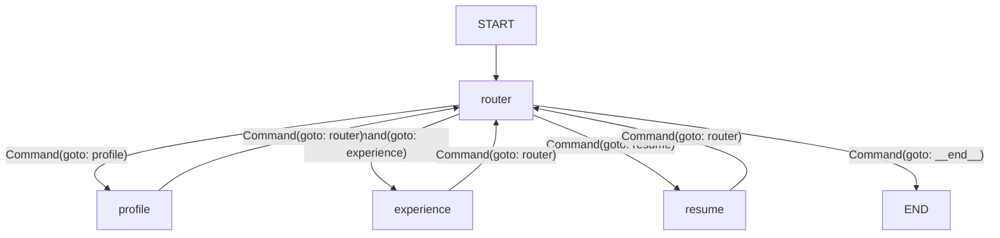

# Career Coach · Multi-Agent AI

> Built with [LangGraph.js v1](https://langchain-ai.github.io/langgraphjs/) + Claude

A conversational career coaching system powered by three specialist AI agents
that share a persistent state graph. Migrated to LangGraph v1.2 and LangChain v1.x
with the new **Command API** for combined state-update + routing.

---

## Architecture



### Key v1.x Features in Use

| Feature                    | Where                    | Benefit                                                |
| -------------------------- | ------------------------ | ------------------------------------------------------ |
| **`Command` routing**      | All agent nodes          | Combines state updates + routing in one return value   |
| **`ends` parameter**       | `graph.ts` → `addNode()` | Compile-time validation of valid routing destinations  |
| **Typed `Command<"...">`** | Agent return types       | TypeScript ensures `goto` targets are valid node names |
| **`Annotation.Root`**      | `state.ts`               | Stable v1.x state definition with typed reducers       |
| **`CareerStateUpdate`**    | `state.ts` export        | Strongly-typed partial state updates                   |

### Agents

| Agent                | Role                                                 | Method                               |
| -------------------- | ---------------------------------------------------- | ------------------------------------ |
| **Router**           | Orchestrates the session, routes between specialists | Intent detection + `Command` routing |
| **Profile Coach**    | Maps personality & career drivers                    | Colors method + DISC                 |
| **Experience Coach** | Extracts rich role stories                           | STAR + RACI framework                |
| **Resume Coach**     | Crafts job-tailored resumes                          | ATS-optimised Markdown               |

### Shared State (`CareerState`)

```typescript
{
  messages: BaseMessage[]           // Conversation history (messagesStateReducer)
  activeAgent: AgentName            // Display label for CLI UI
  profile: Partial<ColorProfile>    // Colors/DISC output (merged reducer)
  experiences: Experience[]         // Structured past roles (merge-by-id reducer)
  targetJob: string                 // Current job target
  resumeDraft: string               // Resume in Markdown
  agentTurnCount: number            // Turns since last handoff
}
```

State is **persisted** via LangGraph's `MemorySaver` checkpointer —
sessions can be resumed with `--thread <id>`.

---

## Setup

### Prerequisites

- **Node.js 20+** (required by LangChain/LangGraph v1)
- An Anthropic API key

### Install

```bash
npm install
```

### Configure

```bash
export ANTHROPIC_API_KEY=sk-ant-...
```

Or create a `.env` file:

```
ANTHROPIC_API_KEY=sk-ant-...
```

### Run

```bash
# Start a new session
npm start

# Resume an existing session
npm start -- --thread session-1234567890
```

---

## Migration Notes (v0 → v1)

This project was migrated from `@langchain/langgraph@^0.2.0` / `@langchain/core@^0.3.0`
to `@langchain/langgraph@^1.2.0` / `@langchain/core@^1.1.0`. Key changes:

| Area              | v0.x                                   | v1.x                                             |
| ----------------- | -------------------------------------- | ------------------------------------------------ |
| Routing           | `addConditionalEdges` + edge functions | `Command({ update, goto })` in nodes             |
| Node registration | `.addNode(name, fn)`                   | `.addNode(name, fn, { ends: [...] })`            |
| Return types      | `Promise<Partial<CareerState>>`        | `Promise<Command<"nodeName">>`                   |
| State types       | Inline reducers                        | Explicit typed reducers with `CareerStateUpdate` |

---

## Extending the System

### Add a new agent

1. Create `src/agents/myAgent.ts` returning `Command<"router">`:

   ```typescript
   import { Command } from "@langchain/langgraph";
   import type { CareerState } from "../state.js";
   import { Nodes } from "../state.js";

   export async function myAgent(state: CareerState): Promise<Command<"router">> {
     // ... invoke LLM, return state updates + routing
     return new Command({
       update: { messages: [response], activeAgent: "router" },
       goto: Nodes.Router,
     });
   }
   ```

2. Add to `src/graph.ts`:

   ```typescript
   graph.addNode("myagent", myAgent, { ends: [Nodes.Router, END] });
   ```

3. Add `"myagent"` to the `AgentName` union in `src/state.ts`.

4. Update router's system prompt to know about the new agent.

### Suggested additional agents

| Agent                  | Purpose                                                          |
| ---------------------- | ---------------------------------------------------------------- |
| **Interview Coach**    | Prepares STAR answers for interview questions                    |
| **Salary Coach**       | Researches market rates and negotiation tactics                  |
| **LinkedIn Coach**     | Rewrites the LinkedIn profile to match the resume                |
| **Cover Letter Coach** | Drafts tailored cover letters                                    |
| **Gap Analyser**       | Identifies skill gaps vs target role and suggests learning paths |

---

## Project Structure

```
src/
├── state.ts                  # Shared CareerState + types (Annotation.Root)
├── graph.ts                  # StateGraph with Command-based routing
├── index.ts                  # CLI entrypoint
├── demo-ui.jsx               # React demo UI component
└── agents/
    ├── routerAgent.ts        # Orchestrator + intent router
    ├── profileAgent.ts       # Colors/DISC profiler
    ├── experienceAgent.ts    # Experience extractor
    └── resumeAgent.ts        # Resume builder
```

---

## Data Flow Example

```
User: "I want to work on my resume for a Product Manager role at Stripe"
  │
  ▼
[router] → detects resume intent
         → returns Command({ update: {...}, goto: "resume" })
  │
[resumeAgent] → asks for JD → user pastes JD
  │
[resumeAgent] → maps experiences to JD → drafts resume
              → returns Command({ update: {...}, goto: "router" })
  │
[resumeAgent] → user approves
              → returns Command({ update: { resumeDraft, activeAgent: "router" }, goto: "router" })
  │
[router] → "Your resume is ready! Want to also prep for the interview?"
```
