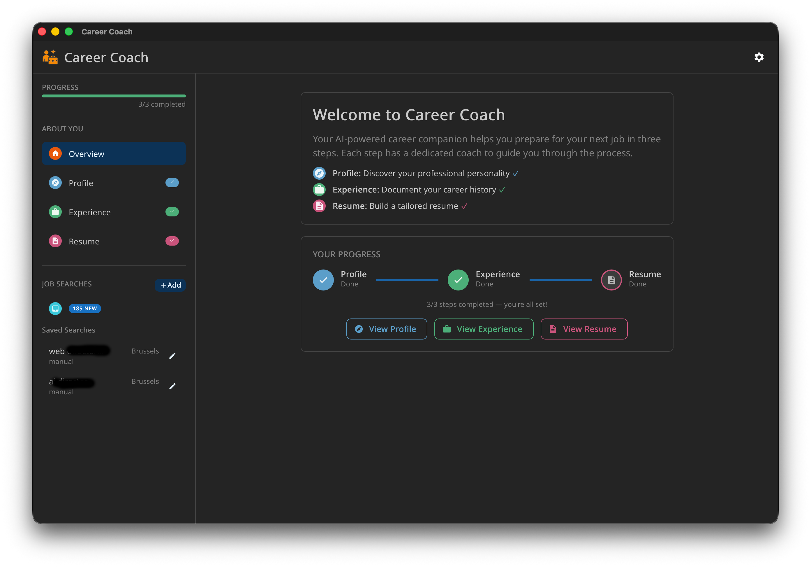

# Career Coach

> Multi-agent AI career coaching — job search, resume tailoring, and interview prep.
> Built with **Tauri 2** + **Vite** + **React** + **Mantine 9**, powered by **LangGraph.js** and Claude.



---

## Features

| Capability      | Description                                                       |
| --------------- | ----------------------------------------------------------------- |
| **Job Search**  | Search jobs from Indeed & LinkedIn via `ts-jobspy`, with scheduling |
| **AI Coaching** | Profile (Colors/DISC), experience extraction, and resume building |
| **Scoring**     | ATS keyword match + human authenticity scoring via LangGraph      |
| **Research**    | LLM-generated company culture, market position, and news          |
| **Generation**  | Writer → Scorer → Reviewer pipeline for adapted resumes & cover letters |
| **Tracking**    | State machine for job statuses (new, applied, interview, offer…)  |
| **Export**      | Export to PDF, Markdown, or JSON                                  |

---

## Architecture

```
┌─────────────────────────────────────────────────────┐
│                  Tauri Desktop App                    │
│  ┌───────────────────────────────────────────────┐  │
│  │              Vite + React + Mantine            │  │
│  │  ┌─────────┐ ┌──────────┐ ┌────────────────┐  │  │
│  │  │  Inbox  │ │ Results  │ │  Job Detail     │  │  │
│  │  │         │ │          │ │  ┌────────────┐ │  │  │
│  │  │         │ │          │ │  │ Resume Tab │ │  │  │
│  │  │         │ │          │ │  │ CV Tab     │ │  │  │
│  │  │         │ │          │ │  │ Research   │ │  │  │
│  │  └─────────┘ └──────────┘ │  └────────────┘ │  │  │
│  │                           └────────────────┘  │  │
│  │  ┌──────────────────────────────────────────┐  │  │
│  │  │          AI Coaches (Chat Panels)         │  │  │
│  │  │   Profile · Experience · Resume · Job     │  │  │
│  │  └──────────────────────────────────────────┘  │  │
│  └───────────────────────────────────────────────┘  │
│                         │                            │
│  ┌──────────────────────┴────────────────────────┐  │
│  │  Services (LangGraph, LLM calls, job-spy)      │  │
│  │  ┌──────────┐ ┌──────────┐ ┌───────────────┐  │  │
│  │  │ Agent    │ │ Generation│ │ Job Scorer    │  │  │
│  │  │ Sessions │ │ Pipeline  │ │ + Researcher  │  │  │
│  │  └──────────┘ └──────────┘ └───────────────┘  │  │
│  └──────────────────────┬────────────────────────┘  │
│                         │                            │
│  ┌──────────────────────┴────────────────────────┐  │
│  │            SQLite (via zod-sqlite)              │  │
│  └───────────────────────────────────────────────┘  │
└─────────────────────────────────────────────────────┘
```

### Tech Highlights

| Aspect                | Technology                                        |
| --------------------- | ------------------------------------------------- |
| Framework             | Tauri 2 (Rust shell) + Vite 8 + React 19          |
| UI                    | Mantine 9 with Noto Sans + responsive layout      |
| State Management      | Zustand + TanStack Query + LangGraph Annotation   |
| AI Orchestration      | LangGraph.js v1.4 with `StateGraph` + checkpointer |
| LLM Providers         | Anthropic, OpenAI, Mistral, DeepSeek, Google       |
| Structured Output     | Zod v4 schemas → `withStructuredOutput`            |
| Database              | SQLite via `@tauri-apps/plugin-sql` + `zod-sqlite` |
| Job Data              | `ts-jobspy` (Indeed & LinkedIn scraping)           |
| Testing               | Vitest + Testing Library + jsdom                    |

### Agents

| Agent                | Role                                                 |
| -------------------- | ---------------------------------------------------- |
| **Router**           | Orchestrates coaching sessions, routes between agents |
| **Profile Coach**    | Maps personality & career drivers (Colors/DISC)      |
| **Experience Coach** | Extracts rich role stories (STAR + RACI)             |
| **Resume Coach**     | Crafts ATS-optimised reference resume                |
| **Job Chat**         | Answers questions about a specific job listing       |

### Generation Pipeline

```
Writer ──→ Scorer (ATS) ──→ Reviewer (Human Authenticity)
   ↑                            │
   └────────── re-draft ────────┘  (up to 5 iterations)
```

Targets: ATS ≥ 85%, Human ≥ 80%. Best draft across all iterations is kept.

---

## Setup

### Prerequisites

- **Node.js 20+** and **Rust** (for Tauri)
- An LLM provider API key (Anthropic, OpenAI, Mistral, DeepSeek, or Google)

### Install

```bash
npm install
```

### Configure

Set at least one provider API key — either as an environment variable or in Settings within the app:

```bash
export ANTHROPIC_API_KEY=sk-ant-...
# or: OPENAI_API_KEY, MISTRAL_API_KEY, DEEPSEEK_API_KEY, GOOGLE_API_KEY
```

### Run

```bash
# Development (Vite dev server + Tauri window)
npm run dev

# Or launch Tauri directly
npm run tauri dev
```

---

## Project Structure

```
src/
├── renderer/                  # React UI (Vite renderer)
│   ├── App.tsx                # Root component + router
│   ├── components/
│   │   ├── chat/              # AI coach chat panels
│   │   ├── editors/           # Profile, experience, resume editors
│   │   ├── inbox/             # Saved job listings inbox
│   │   ├── job-detail/        # Job detail with tabs (resume, CV, research)
│   │   ├── layout/            # AppShell, navbar, API key gate
│   │   ├── nav/               # Navigation panel with saved searches
│   │   ├── results/           # Search results table
│   │   ├── search/            # Search creation modal
│   │   └── shared/            # Reusable UI components
│   ├── hooks/                 # TanStack Query hooks + custom hooks
│   ├── stores/                # Zustand stores (career, job search, layout)
│   └── theme.ts               # Mantine theme config
├── services/                  # Backend services (runs in Tauri webview)
│   ├── database.ts            # SQLite connection via @tauri-apps/plugin-sql
│   ├── agent-session.ts       # LangGraph career coaching sessions
│   ├── generation-graph.ts    # Resume/CV generation pipeline (LangGraph)
│   ├── job-service.ts         # Job CRUD + queries
│   ├── search-service.ts      # Search definitions CRUD
│   ├── jobspy-client.ts       # ts-jobspy wrapper
│   ├── job-scorer.ts          # LLM-based job fit scoring
│   ├── company-researcher.ts  # LLM company research
│   ├── scheduler.ts           # Scheduled search execution
│   ├── status-service.ts      # Job status state machine
│   └── sql-checkpointer.ts    # LangGraph checkpointer backed by SQLite
└── shared/                    # Shared types, state, and utilities
    ├── state.ts               # CareerState (LangGraph Annotation)
    ├── types.ts               # Core TypeScript types
    ├── db-migrations.ts       # Database schema + migrations (zod-sqlite)
    ├── db-schema.ts           # Zod validation schemas per table
    ├── llm-provider.ts        # Multi-provider LLM factory
    └── agents/                # Agent implementations (shared)
```

---

## Data Flow

### Job Search

```
SearchModal → search-service → jobspy-client → ts-jobspy → Indeed/LinkedIn
                  │                                              │
                  ▼                                              ▼
            SQLite (searches)                            SQLite (jobs)
                  │                                              │
                  ▼                                              ▼
            NavPanel ← stats                             InboxView / ResultsView
```

### AI Coaching

```
CoachChatPanel → agent-session → LangGraph StateGraph
                    │                    │
                    ▼                    ▼
              SQLite (career data)   LLM Provider (Claude/GPT/etc.)
```

### Document Generation

```
JobDetailView → generation-graph
                    │
                    ▼
     Writer → Scorer → Reviewer (loop up to 5×)
                    │
                    ▼
              SQLite (adapted_resumes / cover_letters)
```
